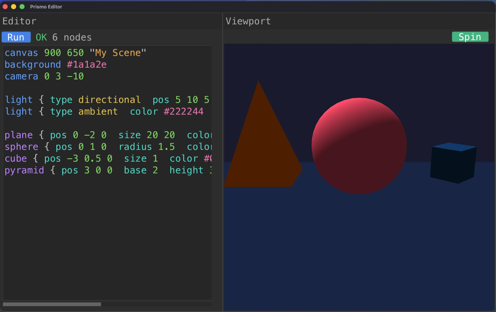

# Prismo

A scene description language with a built-in editor. Write simple, readable code to describe 2D and 3D scenes, hit Run, and see them rendered in real time.

Everything is built from scratch in C — the lexer, parser, renderer, and editor UI. No engines, no frameworks.




## Quick Start

```bash
brew install glfw
make
./prismo                        # opens the editor
./prismo examples/demo.scene    # renders a file directly
```

## The Editor

Run `./prismo` with no arguments to open the built-in editor. You get a code panel on the left and a live viewport on the right. Write your scene, press Cmd+Enter (or click Run), and it renders.

Supports syntax highlighting, Cmd+Backspace/Option+Backspace, copy/paste, undo — the usual stuff.

## The Language

```
canvas 900 650 "My Scene"
background #1a1a2e
camera 0 3 -10

light { type directional  pos 5 10 5  color #ffffff  intensity 1.0 }
light { type ambient  color #222244  intensity 0.3 }

plane { pos 0 -2 0  size 20 20  color #16213e }
sphere { pos 0 1 0  radius 1.5  color #e94560 }
cube { pos -3 0.5 0  size 1  color #0f3460  rotate 0 45 0 }
pyramid { pos 3 0 0  base 2  height 3  color #ff6600 }
```

**Shapes:** `cube`, `sphere`, `pyramid`, `plane`, `circle`, `rect`, `line`, `triangle`

**Properties:** `pos`, `color`, `size`, `radius`, `rotate`, `scale`, `opacity`, `fill solid|wireframe`

**Lighting:** `directional`, `ambient`, `point`

You can group shapes together:

```
group "tower" {
    pos 0 0 0
    cube { pos 0 0 0  size 2  color #ff3344 }
    sphere { pos 0 2 0  radius 0.8  color #ffcc00 }
}
```

Comments work with `//` or `#`.

## How It Works

```
.scene file → Lexer → Parser → AST → Renderer → OpenGL
```

Hand-written lexer tokenizes the source. Recursive descent parser builds an AST. Renderer walks the tree and issues OpenGL draw calls. No bytecode, no VM.

## Building

Needs GLFW and a C compiler. On macOS:

```bash
brew install glfw
make
```

## License

Do whatever you want with it.
